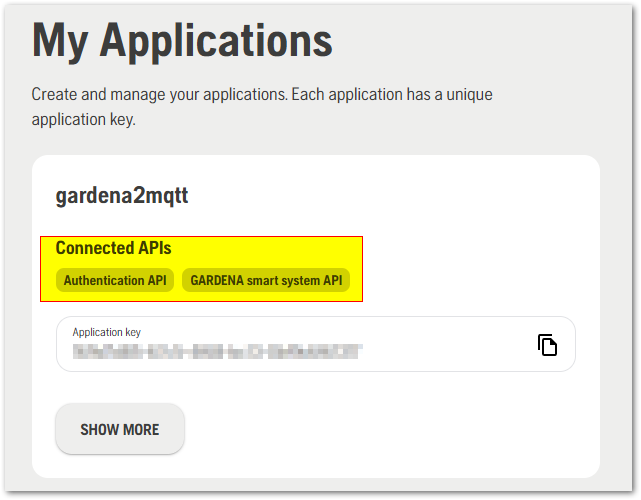
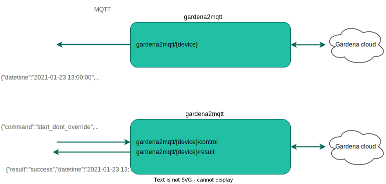

# Prerequisites

You need one or more Gardena Smart system devices : https://www.gardena.com/int/products/smart-system/smart-system  
Follow the official documentation to have API accesses for Authentication and GARDENA : https://developer.husqvarnagroup.cloud/docs/get-started  
This application needs to be connected to Authentication API AND GARDENA smart system API like this : 
  


This image uses the new Gardena API which allows to be informed immediately when an event occurs on any Smart System device.

# How does it work



# How-to
## Install
For Docker, run it by executing the following commmand:

```bash
docker run \
    -d \
    --name gardena2mqtt \
    --restart=always \
    -e GARDENA_CLIENT_ID="GardenaApplicationKey" \
    -e GARDENA_CLIENT_SECRET="GardenaApplicationSecret" \
    -e MQTT_HOST="192.168.1.x" \
    -e MQTT_PORT=1883 \
    -e MQTT_PREFIX="gardena2mqtt" \
    -e MQTT_CLIENTID="gardena2mqttclid" \
    -e MQTT_USER="usr" \
    -e MQTT_PASSWORD="pass" \
    domochip/gardena2mqtt
```
For Docker-Compose, use the following yaml:

```yaml
version: '3'
services:
  gardena2mqtt:
    container_name: gardena2mqtt
    image: domochip/gardena2mqtt
    environment:
    - GARDENA_CLIENT_ID=GardenaApplicationKey
    - GARDENA_CLIENT_SECRET=GardenaApplicationSecret
    - MQTT_HOST=192.168.1.x
    - MQTT_PORT=1883
    - MQTT_PREFIX=gardena2mqtt
    - MQTT_CLIENTID=gardena2mqttclid
    - MQTT_USER=mqtt_username
    - MQTT_PASSWORD=mqtt_password
    restart: always
```

### Configure

### Parameters explanation

#### Environment variables
* `GARDENA_CLIENT_ID`: Gardena Application key you got at https://developer.husqvarnagroup.cloud/applications
* `GARDENA_CLIENT_SECRET`: Gardena Secret
* `MQTT_HOST`: IP address or hostname of your MQTT broker
* `MQTT_PORT`: **Optional**, port of your MQTT broker
* `MQTT_PREFIX`: **Optional**, prefix used in topics for subscribe/publish
* `MQTT_CLIENTID`: **Optional**, MQTT client id to use
* `MQTT_USER`: **Optional**, MQTT username
* `MQTT_PASSWORD`: **Optional**, MQTT password

# Topics
## gardena2mqtt status

Status of gardena2mqtt is published to the topic **gardena2mqtt/connected** using the following payload: 
 - `0`: disconnected
 - `1`: connected to MQTT only
 - `2`: connected to MQTT AND to Gardena Smart System Cloud

## Devices state

Devices informations and state are published to individual topics following this scheme: 
**gardena2mqtt/Device**

ex : **gardena2mqtt/MySileno**

Devices informations are published when:
 - gardena2mqtt starts
 - reconnects to Gardena or to the MQTT broker
 - whenever an update is sent by Gardena

## Device control

You can control your Gardena devices by sending command (JSON format) to the control topic of each device: 
**gardena2mqtt/Device/control**
And receive command execution result on: 
**gardena2mqtt/Device/result**

ex : 
**gardena2mqtt/MySileno/control**  
**gardena2mqtt/MySileno/result**

### Mower

 - `{"command":"start_seconds_to_override", "duration":3600}`: Manual operation (duration is seconds and must be positive multiple of 60)
 - `{"command":"start_dont_override"}`: Automatic operation.
 - `{"command":"park_until_next_task"}`: Cancel the current operation and return to charging station.
 - `{"command":"park_until_further_notice"}`: Cancel the current operation, return to charging station, ignore schedule.

### Power Socket

 - `{"command":"start_seconds_to_override", "duration":3600}`: Manual operation (duration is seconds and must be positive multiple of 60)
 - `{"command":"start_override"}`: Manual'on'
 - `{"command":"stop_until_next_task"}`: Immediately switch 'off', continue with the schedule.
 - `{"command":"pause"}`: Skip automatic operation until specified time. The currently active operation will NOT be cancelled.
 - `{"command":"unpause"}`: Restore automatic operation if it was paused.

### Smart Irrigation Control (Valve Set)

 - `{"command":"start_seconds_to_override", "duration":3600, "valve_id":"id"}`: Manual operation (duration is seconds and must be positive multiple of 60)
 - `{"command":"stop_until_next_task", "valve_id":"id"}`: Cancel the current watering, continue with the schedule.
 - `{"command":"pause", "valve_id":"id"}`: Skip automatic operation until specified time. The currently active operation might or might not be cancelled (depends on device model).
 - `{"command":"unpause", "valve_id":"id"}`: Restore automatic operation if it was paused.

### Water Control (Valve)

 - `{"command":"start_seconds_to_override", "duration":3600}`: Manual operation (duration is seconds and must be positive multiple of 60)
 - `{"command":"stop_until_next_task"}`: Cancel the current watering, continue with the schedule.
 - `{"command":"pause"}`: Skip automatic operation until specified time. The currently active operation might or might not be cancelled (depends on device model).
 - `{"command":"unpause"}`: Restore automatic operation if it was paused.

# Troubleshoot
## Logs
You need to have a look at logs using :  
`docker logs gardena2mqtt`

# Updating
To update to the latest Docker image:
```bash
docker stop gardena2mqtt
docker rm gardena2mqtt
docker rmi domochip/gardena2mqtt
# Now run the container again, Docker will automatically pull the latest image.
```
# Ref/Thanks

Many thanks to py-smart-gardena which the library used to build this project : 
https://github.com/py-smart-gardena/py-smart-gardena
